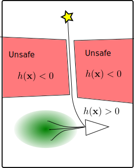
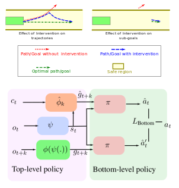
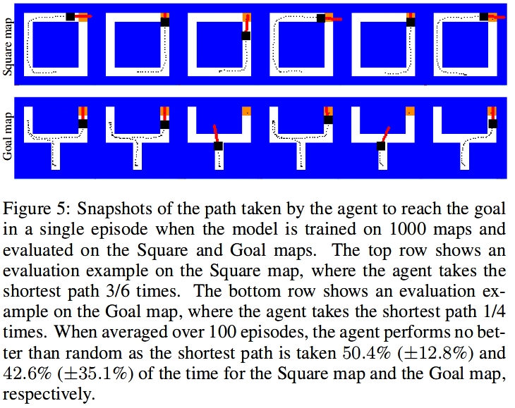
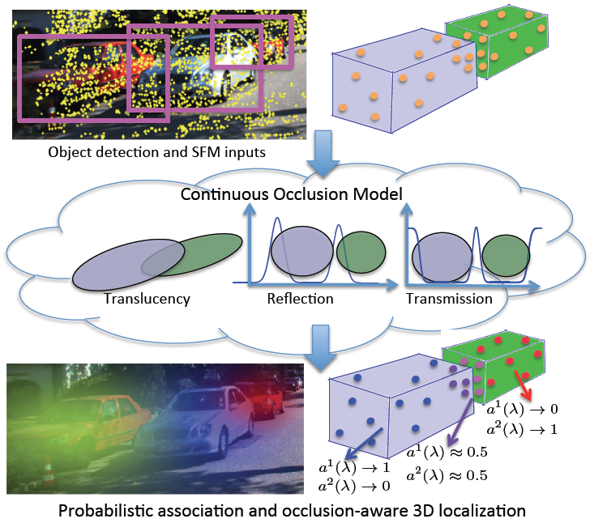
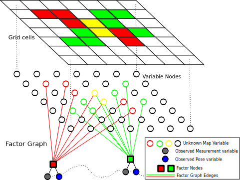
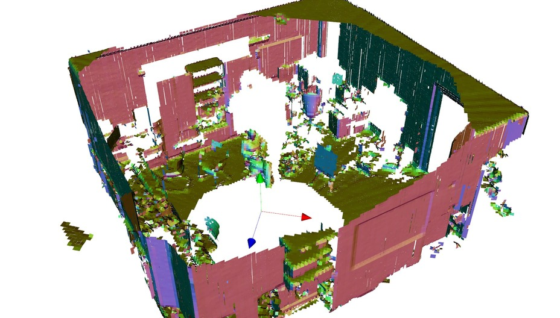
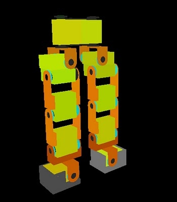
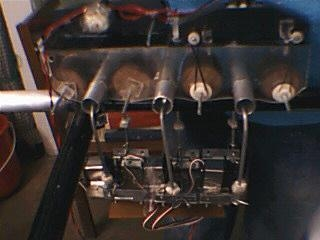

title:Home
home_nav_class: active

<!------------------------------------------------------------------
Start of Markdown
-------------------------------------------------------------------->

<h1>Vikas Dhiman</h1>
 
Postdoc Researcher with <a href="https://natanaso.github.io/"> Nikolay Atanasov</a> and 
<a href="http://www.hichristensen.net/">Henrik Christensen</a> at UC San Diego 
I did my PhD
with <a href="http://web.eecs.umich.edu/~jjcorso/"> Dr. Jason Corso</a>  
University of Michigan, Ann Arbor 

 d h i m a n [@T] umich [D0T] edu 

<a href="images/resume.pdf"> Resume</a> 
&nbsp;|&nbsp;
<a href="https://github.com/wecacuee/"> Github</a> 
&nbsp;|&nbsp;
<a href="https://scholar.google.com/citations?user=6Pn0FGUAAAAJ&hl=en"> Google scholar</a> 
&nbsp;|&nbsp;
<a href="http://keys.gnupg.net/pks/lookup?op=get&search=0xB111F9DBEFC3DD0E">PGP Public key</a>

## Probabilistic Safety Constraints

[Paper](https://arxiv.org/abs/1912.10116)
[Bibtex](publications/mypub_bib.html)

We propose Probabilistic Safety Constraints for High Relative Degree System Dynamics.
 
 

 This paper focuses on learning a model of system dynamics online while satisfying safety constraints. Our motivation is to avoid offline system identification or hand-specified dynamics models and allow a system to safely and autonomously estimate and adapt its own model during online operation. Given streaming observations of the system state, we use Bayesian learning to obtain a distribution over the system dynamics. In turn, the distribution is used to optimize the system behavior and ensure safety with high probability, by specifying a chance constraint over a control barrier function. 
 
 

 

Mohammad Javad Khojasteh, Vikas Dhiman, Massimo Franceschetti, Nikolay Atanasov
"Probabilistic Safety Constraints for Learned High Relative Degree System Dynamics"

#### Presentation in ITA on Feb 4

<iframe width="600" height="400"
  src="presentation/ita-mjkhojas-2020-02-04/index.html" ></iframe>

## Hierarchical policies for Learning from Intervention

[Paper](https://arxiv.org/abs/1912.02241)
[Bibtex](publications/mypub_bib.html)

We propose a hierarchical framework for Learning from Intervention to account
for expert's reaction delay.
 
 

Learning from Demonstrations (LfD) via Behavior Cloning (BC) works well on multiple complex tasks. However, a limitation of the typical LfD approach is that it requires expert demonstrations for all scenarios, including those in which the algorithm is already well-trained. The recently proposed Learning from Interventions (LfI) overcomes this limitation by using an expert overseer. The expert overseer only intervenes when it suspects that an unsafe action is about to be taken. Although LfI significantly improves over LfD, the state-of-the-art LfI fails to account for delay caused by the expert's reaction time and only learns short-term behavior. We address these limitations by 1) interpolating the expert's interventions back in time, and 2) by splitting the policy into two hierarchical levels, one that generates sub-goals for the future and another that generates actions to reach those desired sub-goals. This sub-goal prediction forces the algorithm to learn long-term behavior while also being robust to the expert's reaction time. Our experiments show that LfI using sub-goals in a hierarchical policy framework trains faster and achieves better asymptotic performance than typical LfD.

Jing Bi, Vikas Dhiman, Tianyou Xiao, Chenliang Xu.
Learning from interventions using hierarchical policies for safe learning with delayed expert.

## Lecture on Particle, Kalman Filters and SLAM

A guest lecture on SLAM in [Intro to Robotics](http://www.hichristensen.com/CSE276A-19/schedule.html) on Oct 22, 2019.
[Colab Notebooks and slides](https://drive.google.com/drive/folders/1SqsoJ0k9ecLeFbEBTXPWx7QvB0jQQ47m)

## Defended my thesis on Localization, Mapping and Navigation

Defended my thesis on Dec 3, 2018.

<iframe width="600" height="400"
  src="presentation/defence-20181203/index.html" ></iframe>

[Thesis](https://deepblue.lib.umich.edu/bitstream/handle/2027.42/150011/dhiman_1.pdf?sequence=1&isAllowed=y)

## A Critical Investigation of Deep Reinforcement Learning for Navigation
<!-- [Paper](https://arxiv.org/abs/1802.02274v1) https://openreview.net/forum?id=BkiIkBJ0b) 
&nbsp;|&nbsp;
-->
[Paper](https://arxiv.org/abs/1802.02274v1)
&nbsp;|&nbsp;
[Code](https://github.com/umrobotslang/does-drl-learn-to-navigate)

We find the Deep Reinforcement Learning for Navigation does not navigate on new maps.

 
 

The navigation problem is classically approached in two steps: an exploration step, where map-information about the environment is gathered; and an exploitation step, where this information is used to navigate efficiently. Deep reinforcement learning (DRL) algorithms, alternatively, approach the problem of navigation in an end-to-end fashion. Inspired by the classical approach, we ask whether DRL algorithms are able to inherently explore, gather and exploit map-information over the course of navigation. We build upon Mirowski et al. [2017] work and introduce a systematic suite of experiments that vary three parameters: the agent's starting location, the agent's target location, and the maze structure. We choose evaluation metrics that explicitly measure the algorithm's ability to gather and exploit map-information. Our experiments show that when trained and tested on the same maps, the algorithm successfully gathers and exploits map-information. However, when trained and tested on different sets of maps, the algorithm fails to transfer the ability to gather and exploit map-information to unseen maps. Furthermore, we find that when the goal location is randomized and the map is kept static, the algorithm is able to gather and exploit map-information but the exploitation is far from optimal. We open-source our experimental suite in the hopes that it serves as a framework for the comparison of future algorithms and leads to the discovery of robust alternatives to classical navigation methods. 

## Lecture on Probabilistic Graphical Models

A guest lecture on PGMs in [Advanced Topics in Computer Vision](http://web.eecs.umich.edu/~jjcorso/t/542W17/)

<iframe width="600" height="400" src="eecs442/20171109.html" ></iframe>

## A Continuous Occlusion Model for Road Scene Understanding 
[Paper](images/continuousocclusion.pdf)
[Supplementary](images/supplementarymaterial.pdf)
[Bibtex](publications/mypub_bib.html)

We propose to model cars as transparent ellipsoids rather cuboids to handle occlusion probabilistically.

 
 
We present a physically interpretable, continuous three-dimensional (3D) model for handling occlusions with applications to road scene understanding. We probabilistically assign each point in space to an object with a theoretical modeling of the reflection and transmission probabilities for the corresponding camera ray. Our modeling is unified in handling occlusions across a variety of scenarios, such as associating structure from motion (SFM) point tracks with potentially occluding objects or modeling object detection scores in applications such as 3D localization. For point track association, our model uniformly handles static and dynamic objects, which is an advantage over motion segmentation approaches traditionally used in multibody SFM. Detailed experiments on the KITTI raw dataset show the superiority of the proposed method over both state-of-the-art motion segmentation and a baseline that heuristically uses detection bounding boxes for resolving occlusions. We also demonstrate how our continuous occlusion model may be applied to the task of 3D localization in road scenes.

V. Dhiman and Q. Tran and J. J. Corso and M. Chandrakar
A Continuous Occlusion Model for Road Scene Understanding

## Pinhole camera workshop for middle school students
[Presentation](xplore-workshop/pinhole.pdf)

## Modern MAP algorithms for occupancy grid mapping 

[Paper](images/modern_map.pdf)
[Bibtex](publications/mypub_bib.html)
[Code](https://github.com/wecacuee/modern-occupancy-grid)

We propose to use modern graphical model inference techniques like Dual
Decomposition and Belief Propagation for occupancy grid mapping.

 
 

Using the inverse sensor model has been popular in occupancy grid mapping. 
However, it is widely known that applying the inverse sensor model to mapping 
requires certain assumptions that are not necessarily true. Even the works
that use forward sensor models have relied on methods like expectation
maximization or Gibbs sampling which have been succeeded by more effective
methods of maximum a posteriori (MAP) inference over graphical models. In this
paper, we propose the use of modern MAP inference methods along with the
forward sensor model. Our implementation and experimental results demonstrate
that these modern inference methods deliver more accurate maps more
efficiently than previously used methods.

V. Dhiman and A. Kundu and F. Dellaert and J. J. Corso
 Modern MAP inference methods for accurate and faster occupancy
	    grid mapping on higher order factor graphs

## Voxel Planes 

[Paper](http://www.cse.buffalo.edu/~jryde/publications/iros2013_voxel_planes.pdf)
[Bibtex](publications/mypub_bib.html)
[Presentation](voxelplanes/presentation.html)
[Code](https://bitbucket.org/wecacuee/voxelplanes)

We propose using small planes inside voxels to model 3D surfaces and
corresponding algorithms to reconstruct them fast and accurately.
 
 

Conversion of unorganized point clouds to surface reconstructions is increasingly required in the mobile robotics perception processing pipeline, particularly with the rapid adoption of RGB-D (color and depth) image sensors.
Many contemporary methods stem from the work in the computer graphics community in order to handle the point clouds generated by tabletop scanners in a batch-like manner.
The requirements for mobile robotics are different and include support for real-time processing, incremental update, localization, mapping, path planning, obstacle avoidance, ray-tracing, terrain traversability assessment, grasping/manipulation and visualization for effective human-robot interaction.

We carry out a quantitative comparison of Greedy Projection and Marching cubes along with our voxel planes method.  The execution speed, error, compression and visualization appearance of these are assessed.
Our voxel planes approach first computes the PCA over the points inside a voxel, combining these PCA results across 2x2x2 voxel neighborhoods in a sliding window.  Second, the smallest eigenvector and voxel centroid define a plane which is intersected with the voxel to reconstruct the surface patch (3-6 sided convex polygon) within that voxel.  By nature of their construction these surface patches tessellate to produce a surface representation of the underlying points.

In experiments on public datasets the voxel planes method is 3 times faster than marching cubes, offers 300 times better compression than Greedy Projection, 10 fold lower error than marching cubes whilst allowing incremental map updates.

J. Ryde, V. Dhiman, and R. Platt. Voxel planes: Rapid visualization and meshification of point cloud ensembles. (IROS), November 2013

## Kinfu based localization for Augmented Reality 

Used Kinect Fusion based camera localization from PCL library to render
augmented reality (using VTK) that enables user to add markers to describe
arbitrary objects in 3D.

<iframe class="embed-responsive-item" style="max-width:560px" height="315" src="//www.youtube-nocookie.com/embed/J62VZ7DGZfc" frameborder="0" allowfullscreen></iframe>

## Head tracking using RGBD at Hackathon 

[Code](https://bitbucket.org/wecacuee/headtracker/)

We used OpenCV face detector, KLT feature tracker, VTK visualizer to 
cook up a head tracker at UB Hackathon 2013 within 24 hours.

<iframe class="embed-responsive-item" style="max-width:560px" height="315" src="//www.youtube-nocookie.com/embed/UlOsM9wbi3Y" frameborder="0" allowfullscreen></iframe>

## Mutual Localization 

[Paper](http://www.cse.buffalo.edu/~jryde/publications/iros2013_mutual_localization.pdf)
[Bibtex](publications/mypub_bib.html)
[Presentation](mutloc/presentation.html)
[Code](mutloc/doc/index.html)

We propose 3-point algorithm for two cameras to localize each other in 6-DOF. It
is a generalization of Perspective-3-Point algorithm when the 3-Points are
distributed and observed in two separate camera frames.

Concurrently estimating the 6-DOF pose of multiple cameras or
robots---cooperative localization---is a core problem in contemporary
robotics.  Current works focus on a set of mutually observable world landmarks
and often require inbuilt egomotion estimates; situations in which both
assumptions are violated often arise, for example, robots with erroneous low
quality odometry and IMU exploring an unknown environment.  In contrast to
these existing works in cooperative localization, we propose a cooperative
localization method, which we call \textit{mutual localization}, that uses
reciprocal observations of camera-fiducials to obviate the need for egomotion
estimates and mutually observable world landmarks.  We formulate and solve an
algebraic formulation for the pose of the two camera mutual localization setup
under these assumptions.  Our experiments demonstrate the capabilities of our
proposal egomotion-free cooperative localization method: for example, the
method achieves 2cm range and 0.7 degree accuracy at 2m sensing for 6-DOF
pose.  To demonstrate the applicability of the proposed work, we deploy our
method on Turtlebots and we compare our results with ARToolKit and Bundler,
over which our method achieves a 10 fold improvement in translation
estimation accuracy.

V. Dhiman, J. Ryde, and J. J. Corso. Mutual localization: Two camera relative 6-dof pose estimation from reciprocal fiducial observation. IROS, November 2013.

{ style="height:150px" }

<iframe class="embed-responsive-item" style="max-width:560px" height="315" src="//www.youtube-nocookie.com/embed/9R546nuWPWA" frameborder="0" allowfullscreen></iframe>

## Multi-Resolution Occupied Voxel Lists (Jan - Jun 2012)

Added a few features like ROS support, support for color voxels to
[MROL](https://launchpad.net/mrol) library by Dr. Julian
Ryde.

<iframe class="embed-responsive-item" style="max-width:560px" height="315" src="//www.youtube-nocookie.com/embed/rJZJS2a9V_0" frameborder="0" allowfullscreen></iframe>

 

## Work Experience (2008-2011) 

At DE Shaw, I have worked on various small automation projects like Web robots, web scrapers, feeds parsers etc. Most of the these applications were written in Perl and a few in Python.

Apart from this I have also worked on a simple web application using J2EE. I used Hibernate, Struts 2 and Spring for the web application.

## Undergrad Projects (2004-2008)

### Biped Robot (July 2007-May 2008)

Our aim for final year project was to design and fabricate a 12 DOF freedom biped that could be used for further development and testing on walking robots. However, due to unforeseen financial constraints we decided to fallback to the fabrication a 4 DOF biped.

I was responsible in the mechanical design and simulation of the robot. 

<a href='biped-robot/index.html' /> More ...  </a>

### Spherical Stepper Motor (June-August 2008)

A motor that could rotate around any axis of rotation passing through its center.

The aim of this project was to fabricate a spherical stepper motor using strategic positioning of electromagnets on the rotor and permanent magnets on the stator.

The strategy of pole placement was inspired by  a paper titled "Kinematic Design and Commutation of a Spherical Stepper Motor" from Gregory S. Chirikjian and David Stein.

<a href="../home/spherical-stepper-motor/index.html" >
More ...
</a>

### Refreshable Braille Display (July-December 2005)

An 8 character electronic BRAILLE display, that could be controlled using a PC. This project was an application of the knowledge that gained while fabrication of "Moving message display" in the first year of my B.Tech. 

The idea was to replace LED's of the "Moving message display" with electromechanical tangible "points" that could be turned on and off to create braille characters. Each character had 6 points and the unit was designed to have 6 characters. The complete unit was controlled through a parallel port of a PC.

### Grid Crossing Robot (December 2005)

A machine for robotic competition called _GRIP_ in _TECHFEST'06_, annual technical festival of IIT Bombay. 

The task provided in the competition was to make a wired/wireless remote controlled machine, which can traverse a
grid 1250 mm high, collect a cylindrical object located at a specific
point below the grid, and then place the cylinder in the hollow
cylindrical container provided.

<a href='../home/grid-crossing-robot/index.html' > More ...  </a>

### Moving message display (February 2005)

A PC controlled moving message display. This project was my first fabrication of an electronic circuit. The circuit design and construction was directly taken from an Electronics for you construction article in December 2004 issue titled <a rel='nofollow' target='_blank' href='http://www.efymagonline.com/data.asp?id=61'>Moving
 Message Over Dot-Matrix Display</a> .
          
<!------------------------------------------------------------------
End of Markdown
--------------------------------------------------------------------!>
